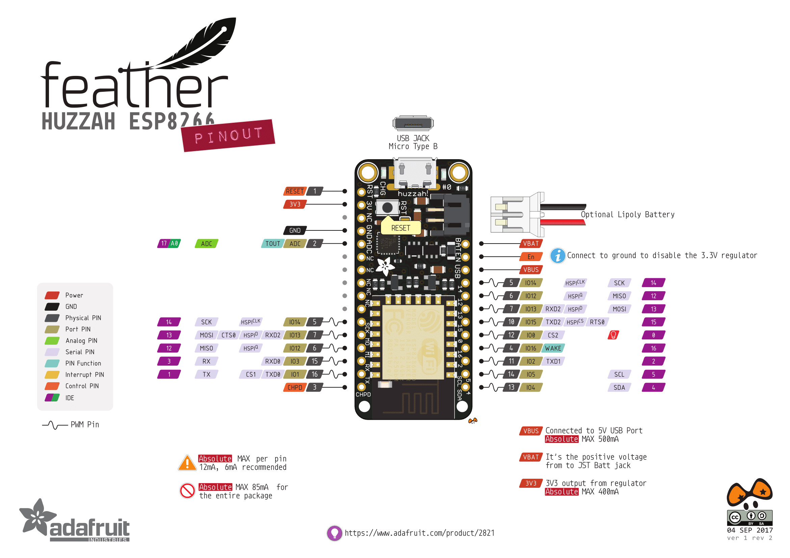

# casa0014-plantMonitor


pi hostname ```stud-pi-ucfnmz0```

SSID ```CE-Hub```

IP address ```10.129.100.215```

MQTT server ```mqtt.cetools.org```

Grafana http://10.129.100.215:3000/

Unique topic name ```student/CASA0014/plant/ucfnmz0/#```


## Intro

This is the repo for CASA0014 - Connected Environments assessment.  The quality of build of the Plant Monitor, which contains hardware integration, Arduino code, connection to network etc will be assessed. The method to design, build and deploy the device, including concept sketches, system design, naming conventions and operational notes should be described in the own documentation.


## Aims and Objectives

The project aims to build a Plant Monitor for a plant locate in the CE Lab. 

+ Monitor the plant for the duration of the course.
+ Complete the necessary steps for sensing the plant environment (Wi-Fi connection, temp, humidity, moisture, etc),
+ Sending relevant data to the internet.
+ Run the monitor for nine months.
+ Extra sensing systems


----


## Basic Tests

###### Blink test

```BlinkTest.ino``` is a simple blink test to test Adafruit Feather HUZZAH ESP8266 board setup. The delay time can be modified to achieve the different blink interval time.

###### Wi-Fi connection test

```wifiCOnnect.ino``` is a test to check the internet connection. SSID and password is modified to connect the CE lab Wi-Fi.

```// wifi config
const char* ssid     = "CE-Hub";
const char* password = "password_for_CE-Hub";
```

###### Time get test
```timeGet.ino``` is a test to obtain the time for different time zone. Time zone GB is used in this project. A one second delay is used in the loop to print the local time in London per second in the serial monitor.

###### MQTT test
```testMQTT.ino``` is a test to push data to an MQTT server. 

```
const char* mqtt_server = "bats.cetools.org"; client.setServer(mqtt_server, 1883);
```

```sendMQTT()``` function sends the message to the MQTT server.

```callback()``` function is called when new messages arrive at the client. The ```if``` statement check the received message. The LED will be on when the message 1, and off when 0.

###### DHT22 test

```DHT22Test.ino``` tests the DHT22 sensor to read the temperature and humidity values. 

###### Moisture test

```testMoisture.ino``` tests the moisture reading. The serial plotter can be used to show the graph of the reading. Two nails are plugged into the soil. The basic principle is to measure the resistance between the two nails. The min value and max value represent the complete resistance and no resistance respectively.


## Current Status

```DHT22_MQTT.ino``` is the Arduino script to achieve the currently completed goals.

+ Setup Feather Huzzah ESP8266 board
+ Wi-Fi Connection
+ Use ezTime Library to get date and local time
+ Reading temperature, humidity value from DHT22
+ Obtain Moisture value
+ MQTT server Connection
+ Sending Soil Data to MQTT
+ Use RPI as a gateway
+ Sending Soil data to influx database using Telegraf server agent to collect and store the data
+ Visualising Data on Grafana


## Some changes

+ For Wi-Fi and MQTT connection, the sensitive data is modified in ```arduino_secrets.h``` to connect Wi-Fi and MQTT.

+ Server host and port are below
```
const char* mqtt_server = "mqtt.cetools.org"; client.setServer(mqtt_server, 1884);
```

+ The client publish topic is modified to a unique name ``` student/CASA0014/plant/ucfnmz0/```
  Publish message for temp: ```student/CASA0014/plant/ucfnmz0/temperature```
  
  for humidity:  ```student/CASA0014/plant/ucfnmz0/humidity```
  
  for moisture: ```student/CASA0014/plant/ucfnmz0/moisture```
  
  announcement: ```student/CASA0014/plant/ucfnmz0/outTopic```
  
  and subscribe: ```student/CASA0014/plant/ucfnmz0/inTopic```

+ In the main ```loop()``` the previous ```minuteChanged()``` function checks the min change. Read the data per minute and send MQTT. ```minuteChanged()``` is replaced by ```secondChanged()```, which listen to the sec change. The previous data collecting and updating is every minute, but now is per second.

  


## Possible Add-on

#### LDR Sensor

add LDR sensor to detect the light via GPIO pins

https://pimylifeup.com/raspberry-pi-light-sensor/


#### Solar panel

connect 1W Solar panel with Solar charger (Adafruit bq24074) for the Lithium Polymer Battery as the power supply. And achieve the long battery life.

bq24074 datasheet

https://cdn-learn.adafruit.com/downloads/pdf/adafruit-bq24074-universal-usb-dc-solar-charger-breakout.pdf

https://randomnerdtutorials.com/power-esp32-esp8266-solar-panels-battery-level-monitoring/

#### Neopixel strip

https://learn.adafruit.com/neopixels-on-raspberry-pi

https://learn.adafruit.com/neopixels-on-raspberry-pi/python-usage

---


.gitignore added


----

**Updated 03 Nov 2011 16 pm**

##### LDR sensor test

Create ```ldrTest.ino```



